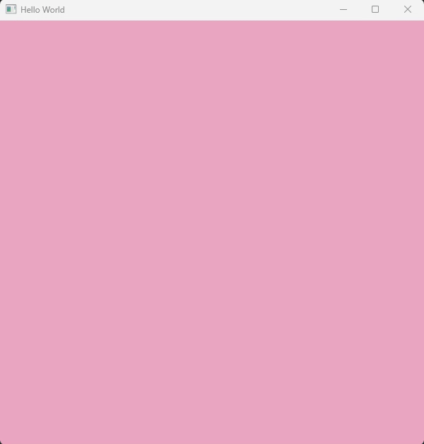

# [Project 1 - Hello World](https://graphics.cs.utah.edu/courses/cs6610/spring2021/?prj=1)
첫 프로젝트는 OpenGL을 사용하는 환경을 설정하는 것입니다. <br>
OpenGL 창을 생성하고 기본 OpenGL 함수를 사용하여 색을 칠해봅시다.

## 요구사항
* C/C++을 사용하세요.
* GLUT, FreeGLUT, GLFW 또는 선택한 다른 UI 라이브러리를 사용하여 OpenGL 창을 만들어보세요.
* OpenGL 뷰포트 크기는 명시적으로 지정되어야 합니다.
* OpenGL 함수를 호출하여 창의 배경색을 설정하세요.
* "Esc" 키를 누르면 창이 닫히도록 해야 합니다.
* 모든 OpenGL 관련 헤더는 include 경로의 GL 디렉토리 안에 배치되어야 하며 슬래시를 사용하여 include 되어야 합니다.<br>
GLFW를 사용하는 경우 기본 헤더 위치에 둘 수 있습니다.
```cpp
#include <GL/freeglut.h>
#include <GLFW/glfw3.h>
```

## CS 6610 학생들에 대한 추가 요구 사항
* 배경 색을 자동으로 애니메이션화하세요.

## 참고
GLUT 또는 FreeGLUT을 사용하는 경우 아래 GLUT 함수들을 주목하세요.
* `glutInit`
* `glutInitDisplayMode`
* `glutInitWindowSize`
* `glutCreateWindow`
* `glutMainLoop`
* `glutLeaveMainLoop`
* `glutPostRedisplay`
* `glutSwapBuffers`
* `glutDisplayFunc`
* `glutKeyboardFunc`
* `glutIdleFunc`

## 결과
<div align=center> 

</div>
